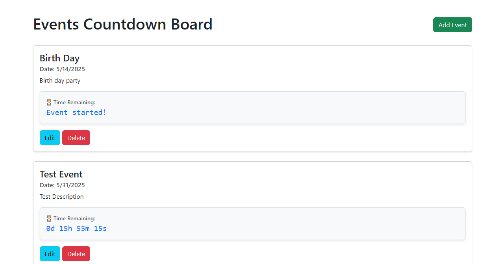
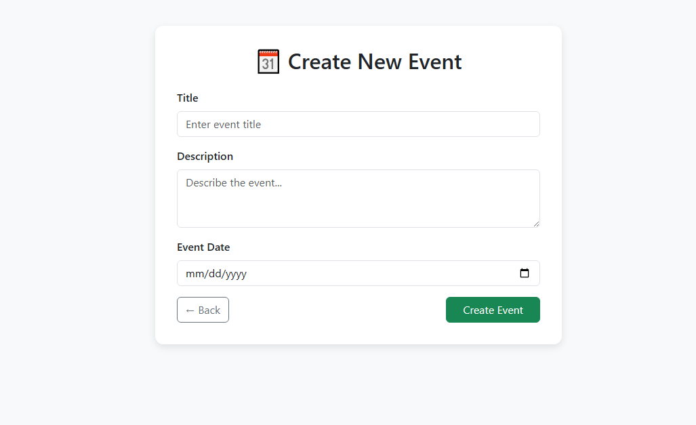
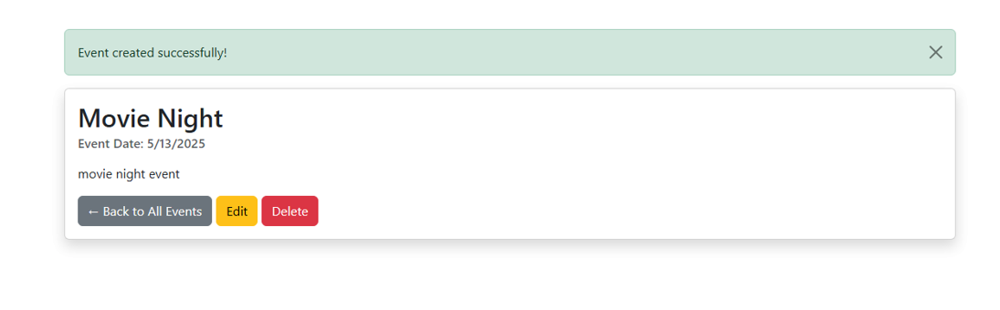
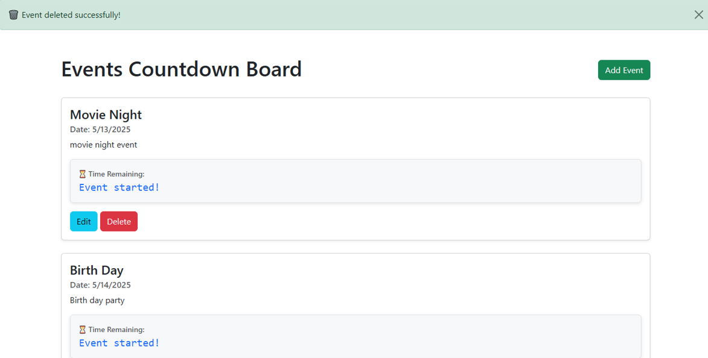
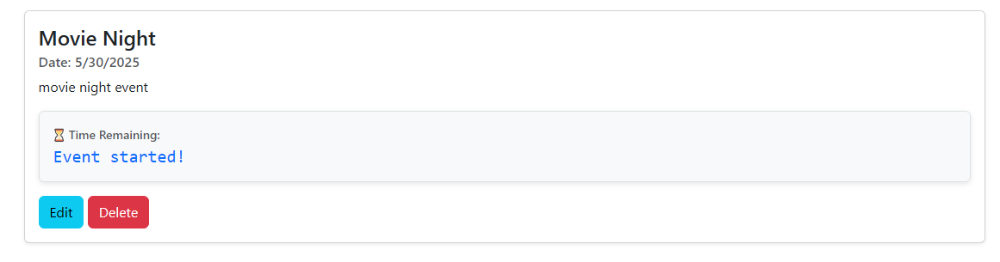

# 🗓️ Event Countdown Board (MongoDB Version)

A beautifully designed Node.js + Express.js web application that allows users to **create, view, edit, and delete events**, with each event displaying a live **countdown timer**. This version uses **MongoDB Atlas** for data storage and incorporates **Bootstrap 5** for responsive design.


⚙️ It supports two modes of data storage:
- **JSON file-based storage**
- **MongoDB** 

## 3. Choose your Data Storage Option

By default, the project uses a local `data/events.json` file to store event data. This is ideal for quick setup.

If you prefer MongoDB:

- Create a MongoDB Atlas cluster or use a local MongoDB instance.
- Update your `.env` file or MongoDB URI in `server.js` accordingly.
- Make sure to uncomment or switch to MongoDB-related code in `event.js` and `routes/event.js`.

## 📸 Screenshots






---

## 📌 Features

- Create new events with a title, description, and date
- Display all events on the homepage in styled Bootstrap cards
- Edit or delete existing events
- Countdown timer for each event
- Flash messages for user actions (e.g. success, delete)
- Fully responsive design with Bootstrap 5

---

-- When event time reached countdown state change to Event Started

## 

## 🛠️ Technologies Used

- Node.js
- Express.js
- MongoDB Atlas
- Mongoose
- EJS (Embedded JavaScript Templates)
- Bootstrap 5
- express-session & connect-flash for flash messages
- Method Override for PUT/DELETE methods in forms

---

## 🚀 Getting Started

### ✅ Prerequisites

Ensure the following are installed:

- [Node.js](https://nodejs.org/)
- [npm](https://www.npmjs.com/)
- [MongoDB Atlas Account](https://www.mongodb.com/cloud/atlas/register)

---

## 📥 Installation

1. **Clone this repository:**

```bash
git clone https://github.com/Ishimwe-Jean-Gloire/event-countdown-board.git
cd event-countdown-board
```

2. **Install dependencies:**

```bash
npm install
```

3. **Set up your MongoDB Atlas URI:**

Create a `.env` file and add:

```
MONGODB_URI=your_mongodb_atlas_uri
SESSION_SECRET=your_secure_session_secret
```

4. **Run the application:**

```bash
npm run devStart
```

5. Open your browser and visit:  
   👉 [http://localhost:5000](http://localhost:5000)

---

## 🧑‍💻 Author

**Jean Gloire Ishimwe**  
_Full Stack Developer & Aspiring UI/UX Designer_  
🔗 _LinkedIn, GitHub, etc._

---

## 📄 License

This project is open-source and available under the [MIT License](LICENSE).
